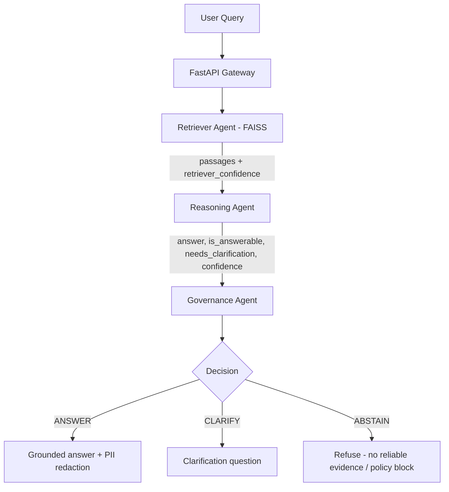

<p align="center">
   <b>Policy-Aware Multi-Agent RAG for Unanswerable Question Detection in the Educational Domain</b>
</p>

<p align="center">
A multi-agent Retrieval-Augmented Generation pipeline in which a policy-aware
<i>governance agent</i> decides, for every question, whether the system should
<b>ANSWER</b>, ask for <b>CLARIFICATION</b>, or <b>ABSTAIN</b> - so that
unanswerable questions are detected and no misleading or guessed answers are
produced in educational settings.
</p>
---

## 🚀 Quick Start

### Option 1: Docker (Recommended)
```bash
git clone https://github.com/alirza-gz
cd 
docker compose up --build
```

Docker Compose deploys each agent as an **independent, separately scalable service**:

| Service | Container | Port | Role |
|---------|-----------|------|------|
| `rag_gateway` | rag_gateway | 8010 / 8501 | FastAPI gateway + Streamlit UI |
| `retriever_service` | retriever_service | 8011 | FAISS vector search |
| `reasoning_service` | reasoning_service | 8012 | LLM / mock reasoning |
| `governance_service` | governance_service | 8013 | Policy-aware decision |
| `postgres` | rag_postgres | 5432 | Audit log storage |
| `ollama` | ollama | 11434 | Local LLM runtime |

The gateway talks to the agents over HTTP via the `RETRIEVER_URL`,
`REASONING_URL`, and `GOVERNANCE_URL` environment variables. When those are
unset (e.g. running `python ra3g.py` locally, or the evaluation harness), the
gateway automatically falls back to running the agents in-process.

### Option 2: Local Installation
```bash
git clone https://github.com/pooyaphoenix/RA3G-Agent.git
cd RA3G-Agent
python3 -m venv venv
source venv/bin/activate  # Windows: venv\Scripts\activate
pip install -r requirements.txt
python ra3g.py --api-port 8010 --ui-port 8501
```

**Access the application:**
- 🌐 **Web UI**: http://localhost:8501
- 📡 **API Docs**: http://localhost:8010/docs
- 🔍 **Health Check**: http://localhost:8010/health

---

## ✨ Features

- 🧭 **Policy-Aware Governance** - Three-way decision: ANSWER / CLARIFY / ABSTAIN
- 🚫 **Unanswerable Question Detection** - Refuses to guess when evidence is missing
- 🤖 **Multi-Agent Architecture** - Retriever, Reasoning, and Governance agents
- 🔬 **Built-in Evaluation Harness** - SQuAD 2.0 + manual educational set, metrics, plots
- ⚖️ **Ablation Baseline** - Compare policy-aware vs. no-governance with one switch
- 🧪 **Mock Reasoning Mode** - Run the whole pipeline without a heavy LLM
- 🔍 **Local RAG System** - FAISS vector search over your own corpus
- 🛡️ **Safety Policy** - Banned-phrase blocking and PII redaction on the answer path
- 📊 **Real-time Logs & Trace** - Traceable, auditable decisions
- 🎨 **Streamlit UI** + 🔌 **FastAPI REST API**
- ⚙️ **Fully Customizable** - Easy configuration via `config.yml`

---

## 🎬 Demo

---

## 🏗️ Architecture

**Agent Flow:**
1. **Retriever Agent** - Finds relevant passages from your corpus via FAISS vector search and reports a retrieval confidence.
2. **Reasoning Agent** - Answers *strictly* from the retrieved passages using an Ollama LLM (or a lexical mock), and self-reports `is_answerable`, `needs_clarification`, and a `confidence`.
3. **Governance Agent** - Applies the policy and chooses one of three actions:
   - **ANSWER** - evidence is sufficient and confidence is high (PII is redacted first);
   - **CLARIFY** - the question is ambiguous or confidence is in the uncertain band;
   - **ABSTAIN** - no supporting evidence, retrieval/confidence below threshold, or a safety-policy violation.



---

## 📖 Usage Examples

### Web UI
1. Open http://localhost:8501
2. Navigate to the **Chat** tab
3. Type your question and get instant answers

### API Request
```bash
curl -X POST 'http://localhost:8010/query' \
  -H 'Content-Type: application/json' \
  -H 'session-id: my-session' \
  -d '{
    "query": "What are the benefits of regular hand washing?",
    "top_k": 5
  }'
```

### API Response
```json
{
  "query": "Which green pigment absorbs light during photosynthesis?",
  "answer": "Chlorophyll absorbs light most strongly in the blue and red regions.",
  "action": "ANSWER",
  "is_answerable": true,
  "clarification_question": "",
  "governance": {
    "enabled": true,
    "action": "ANSWER",
    "approved": true,
    "reason": "approved"
  },
  "trace": [{ "index": 0, "note": "passage about chlorophyll" }],
  "retrieved": [
    { "id": "edu_biology.txt#p0", "text": "...", "source": "edu_biology.txt", "score": 0.61 }
  ],
  "confidence": 0.82,
  "session_id": "my-session"
}
```

For an unanswerable question the same endpoint returns `"action": "ABSTAIN"` with
a refusal message; for an ambiguous one it returns `"action": "CLARIFY"` with a
`clarification_question`. Set `"governance_enabled": false` in the request body
to run the plain-RAG baseline (governance disabled) for comparison.

### Python Client Example
```python
import requests

response = requests.post(
    'http://localhost:8010/query',
    headers={'session-id': 'my-session'},
    json={'query': 'What is machine learning?', 'top_k': 5}
)
print(response.json()['answer'])
```

---

## 🔌 API Endpoints

| Method | Endpoint | Description |
|--------|----------|-------------|
| `POST` | `/query` | Ask a question through RAG |
| `GET` | `/health` | Health check for all agents |
| `GET` | `/health/{agent}` | Health check for specific agent |
| `GET` | `/trace` | Get session query history |
| `DELETE` | `/memory/clear` | Clear session memory |
| `GET` | `/docs` | Interactive Swagger UI |
| `GET` | `/logs/stream/{log_type}` | Stream logs in real-time (SSE) |

**Try it live:** http://localhost:8010/docs

---

## 🛡️ Governance Policy

The governance agent chooses one action per question, in this order of precedence:

1. **ABSTAIN (safety)** - the answer contains a banned phrase (configurable in `config.yml`).
2. **ABSTAIN (answerability)** - the reasoner reports the question as unanswerable, retrieval confidence is below `retriever_abstain_below`, or reasoner confidence is below `reasoner_abstain_below`.
3. **CLARIFY** - the reasoner flagged the question as ambiguous, or confidence falls inside the `clarify_band`.
4. **ANSWER** - evidence is sufficient; PII is redacted before the answer is returned.

Setting `GOVERNANCE_ENABLED: false` (or `governance_enabled: false` in a request)
disables the agent entirely for the ablation baseline.

---

## 🔬 Evaluation

The `eval/` package reproduces the quantitative and qualitative analysis for the thesis.

### Full thesis evaluation (baselines + ablations + reports)

The complete experiment suite compares **Vanilla RAG**, **Single-Agent RAG**, and the
**Policy-Aware Multi-Agent RAG**, runs the four ablations, and generates every
CSV/Markdown artifact:

```bash
# 1) Run all systems over the labelled question set (parameters in eval/experiments.yml)
python -m eval.run_experiments

# 2) Aggregate: mean/std over seeds, % improvement, confusion matrices, per-category
python -m eval.report
```

Outputs land in `results/`: `metrics_summary.csv`, `baseline_improvement.csv`,
`ablation_comparison.csv`, `per_category.csv`, `confusion_binary_*.csv`,
`confusion_decision_*.csv`, and the consolidated `EVALUATION_REPORT.md`.

### Choosing the reasoning backend: mock vs Ollama

The evaluation runs transparently with either backend; select it in
`eval/experiments.yml` (`reasoning_mode: mock | ollama`) or override per run with
`--reasoning-mode`. **Mock** is a deterministic lexical heuristic that needs no
LLM — good for smoke-testing the harness, but it cannot detect underspecified or
false-presupposition questions. **Ollama** uses the real LLM and is what thesis
results should be reported with.

To run with Ollama:

```bash
# 1) Install Ollama (https://ollama.com/download)
#    Windows: download and run the installer, or: winget install Ollama.Ollama
#    Linux:   curl -fsSL https://ollama.com/install.sh | sh
#    macOS:   brew install ollama

# 2) Start the server (skip if the desktop app is already running)
ollama serve

# 3) Pull the model configured in config.yml (OLLAMA_MODEL)
ollama pull qwen2.5:3b-instruct

# 4) Verify the server responds
curl http://localhost:11434/api/tags

# 5) Run the evaluation against Ollama
python -m eval.run_experiments --reasoning-mode ollama
python -m eval.report
```

`run_experiments` performs a preflight check and exits with an actionable
message if the server is unreachable or the model is not pulled. Every
prediction row and the report header record which backend produced them, so
mock and Ollama results cannot be confused.

```bash
# 1) Prepare a balanced SQuAD 2.0 subset (answerable + unanswerable) and build the corpus
python -m eval.prepare_data --limit 200 --balance --clean-corpus

# 2) Run the pipeline over the questions (policy_aware AND baseline in one pass)
#    Use --reasoning-mode mock to run without a heavy LLM.
python -m eval.run_eval --questions data/eval/questions.jsonl --reasoning-mode mock

# 3) Compute metrics (accuracy, precision/recall/F1, false-rejection rate, abstain rate)
python -m eval.metrics

# 4) Build comparison tables, plots, and the qualitative trace report
python -m eval.analyze

# 5) Confidence-threshold sensitivity (answer vs. refuse trade-off curve)
python -m eval.threshold_sweep
```

To evaluate the hand-crafted educational set instead, point step 2 at
`data/eval/educational_questions.jsonl` (its supporting corpus lives in
`data/corpus/edu_*.txt`).

**Outputs** (in `results/`): `predictions.jsonl`, `metrics.json`,
`metrics_comparison.csv`, `metrics_comparison.png`, `action_distribution.png`,
`trace_report.md`, `threshold_sweep.csv`, and `threshold_sweep.png`.

**Reported metrics:** unanswerable-detection accuracy, precision/recall/F1 for the
unanswerable class, false-rejection rate (answerable questions wrongly refused),
and abstain/clarify/answer rates - all computed for the policy-aware system and
the no-governance baseline for direct comparison.

---

## 📂 Adding Documents

1. **Place your documents** in `data/corpus/` directory (`.txt` or `.md` files)
2. **Automatic indexing** - The system builds the FAISS index on startup
3. **Manual indexing** (optional):
   ```bash
   python indexer.py --corpus data/corpus
   ```

**Configuration:** Edit `config.yml` to customize corpus directory and indexing behavior.

---

## ⚙️ Configuration

All settings are in `config.yml`:

```yaml
# Reasoning runtime: "ollama" (real LLM) or "mock" (no LLM needed)
REASONING_MODE: ollama
OLLAMA_URL: http://localhost:11434/api/generate
OLLAMA_MODEL: qwen2.5:3b-instruct
EMBED_MODEL: all-MiniLM-L6-v2

# Auto-build FAISS index on startup
AUTO_BUILD_FAISS: true
CORPUS_DIR: data/corpus

# Master switch: false = plain-RAG ablation baseline
GOVERNANCE_ENABLED: true

# Policy-aware answerability governance (the research core)
GOVERNANCE:
  answerability_enabled: true
  retriever_abstain_below: 0.2   # below this retrieval confidence -> ABSTAIN
  reasoner_abstain_below: 0.3    # below this reasoner confidence  -> ABSTAIN
  clarify_band: [0.3, 0.5]       # confidence in this band         -> CLARIFY

# Safety policy: answers containing these phrases are refused
BANNED_PHRASES:
  - diagnosis
  - prescription
  - classified
  - confidential
```

---

## 🧪 Testing

```bash
# Health check
curl http://localhost:8010/health

# Test query
curl -X POST http://localhost:8010/query \
  -H 'Content-Type: application/json' \
  -H 'session-id: test' \
  -d '{"query": "Hello", "top_k": 3}'
```

---

## 📝 Requirements

- Python 3.8+
- Ollama (for LLM inference)
- Docker (optional, for containerized deployment)

See `requirements.txt` for Python dependencies.

---

## 📧 Contact

**alirza.ghz1@gmail.com**